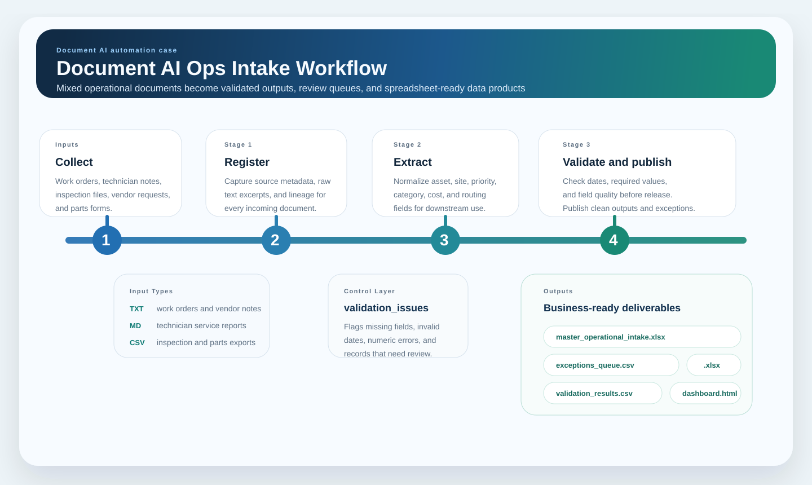

# Document AI Ops Intake

Document automation portfolio case built around semi-structured operational records, validation controls, and spreadsheet-ready outputs for downstream business use.

## Overview

This project simulates a document-heavy intake workflow where work orders, technician reports, inspection files, vendor requests, and parts forms arrive in mixed formats and need to be transformed into a trusted structured dataset.

Instead of treating document processing as a generic OCR showcase, the case frames it as an operational workflow problem: structure the intake, standardize important fields, isolate exceptions, and publish outputs that teams can actually work with.

## Business Problem

Many operations teams still depend on scattered files to receive and manage requests, updates, and field notes. That creates repetitive manual work, weak traceability, and a high chance of reporting from incomplete or invalid records.

This case shows how to make that process more reliable by:

- registering incoming documents consistently
- extracting operationally useful fields
- validating the result before publication
- separating exceptions from approved records
- delivering spreadsheet-ready outputs and a quick review dashboard

## What This Project Demonstrates

- document intake workflow design for semi-structured business records
- field extraction from mixed text and tabular files
- validation rules before business consumption
- exception queue handling
- export packaging across CSV, XLSX, SQLite, and HTML
- a strong `Data + AI + Automation` narrative grounded in operational use cases

## Workflow



Pipeline stages:

1. generate a synthetic inbox with multiple document types
2. register each file in a Bronze-style intake layer
3. extract fields such as asset, site, priority, category, cost, and downtime
4. normalize labels and assign routing metadata
5. validate dates, required fields, and numeric values
6. split approved records from review exceptions
7. publish spreadsheet-ready outputs and a dashboard

## Input Types

The synthetic inbox includes:

- maintenance work orders in `.txt`
- technician service reports in `.md`
- inspection checklist exports in `.csv`
- vendor request messages in `.txt`
- spare-parts request exports in `.csv`

The variety is intentional because real operational intake processes are usually inconsistent.

## Outputs

Running the pipeline generates:

- `data/warehouse/document_ai_ops.db` - local warehouse
- `outputs/master_operational_intake.csv` - approved structured records
- `outputs/master_operational_intake.xlsx` - spreadsheet output for business users
- `outputs/exceptions_queue.csv` - review queue
- `outputs/exceptions_queue.xlsx` - spreadsheet exception queue
- `outputs/validation_results.csv` - validation log
- `outputs/dashboard.html` - local review dashboard
- `outputs/case_summary.html` - short summary page

## Repository Structure

```text
document-ai-ops-intake/
  data/
    inbox/
    warehouse/
  outputs/
    architecture_flow.svg
    dashboard.html
    case_summary.html
    master_operational_intake.csv
    exceptions_queue.csv
    validation_results.csv
  scripts/
    generate_documents.py
    run_pipeline.py
  src/
    document_ai_ops/
      config.py
      extraction.py
      validation.py
      export.py
      pipeline.py
  tests/
    test_pipeline.py
```

## Why The Validation Layer Matters

The strongest part of this case is not only extraction. It is control.

The pipeline is designed to catch issues such as:

- missing asset references
- invalid priorities
- negative quantities or costs
- malformed dates
- incomplete vendor requests

That makes the workflow more believable because it does not assume every document is already clean.

## Quick Start

From this folder:

```powershell
python .\scripts\run_pipeline.py
python -m unittest discover -s .\tests
```

## Why This Case Matters

This project helps make the automation story in the portfolio much clearer. It shows how repetitive, document-heavy work can be structured into a reliable process that reduces manual effort and produces outputs the business can use immediately.

That makes it especially relevant for roles involving:

- internal workflow automation
- operational analytics enablement
- document-driven intake processes
- AI-assisted data preparation

