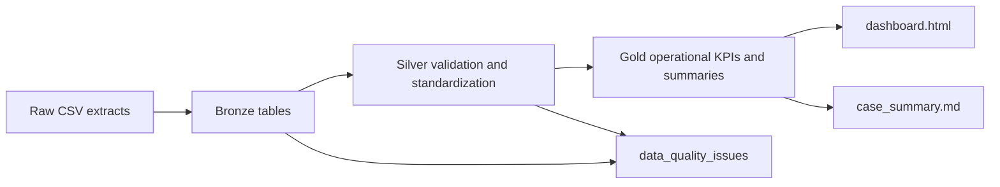

# Architecture And Analysis Guide

## Objective

The objective of this case is to simulate a Microsoft Fabric style operations analytics platform that turns disconnected operational extracts into a decision-ready analytics layer.

The intended audience is:

- recruiters who want to understand the project quickly;
- hiring managers who want to see believable business framing;
- technical interviewers who want to inspect the data flow, modeling choices, and validation logic.

## End-To-End Flow

## Flowchart Files

If you want the architecture as a visual artifact instead of only Markdown, open:

- `outputs/architecture_flow.svg`

That file shows the same pipeline in a recruiter-friendly layout.

## Source domains

The project uses four source domains:

1. `service_tickets.csv`
   Ticket-level workload, priority, status, and SLA expectations.
2. `technician_shifts.csv`
   Workforce capacity, productive hours, and overtime.
3. `downtime_events.csv`
   Operational interruption events and cause groups.
4. `cost_ledger.csv`
   Cost exposure by site and cost type.

## Layer design

### Bronze

Purpose:

- preserve source rows with minimal assumptions;
- keep ingestion simple;
- provide traceability from Gold metrics back to raw inputs.

Bronze tables:

- `bronze_service_tickets`
- `bronze_technician_shifts`
- `bronze_downtime_events`
- `bronze_cost_ledger`

### Silver

Purpose:

- validate source quality;
- convert numeric fields;
- standardize business logic;
- separate trusted from untrusted rows.

Validation examples:

- invalid or unknown `site_id`
- invalid priorities or statuses
- negative costs
- negative downtime
- productive hours that look too high

Silver tables:

- `silver_service_tickets`
- `silver_technician_shifts`
- `silver_downtime_events`
- `silver_cost_ledger`
- `data_quality_issues`

### Gold

Purpose:

- produce business-facing outputs that can feed reporting or semantic models;
- summarize the network by site, technician, and priority.

Gold tables:

- `gold_site_operations_summary`
- `gold_technician_capacity_summary`
- `gold_priority_backlog_summary`
- `gold_exec_kpis`

## Business logic

### KPI logic

The KPI layer summarizes:

- total open backlog
- breached SLAs
- downtime hours
- average workforce utilization

### Site risk logic

The current synthetic risk score is a weighted combination of:

- open backlog
- breached SLA tickets
- average utilization
- downtime hours

This is not meant to be a statistically rigorous score. It is meant to be a believable operational prioritization signal for a portfolio case.

### Workforce logic

The technician view highlights:

- average utilization percentage
- overtime hours
- workload tier

This helps show that the project is not only about tickets, but also about capacity planning.

## How to analyze the outputs

Use this reading sequence:

1. Open `outputs/dashboard.html`
   Start with the KPI cards to understand the scale of the simulated operation.
2. Read the site table
   Compare backlog, SLA pressure, downtime, cost, and risk across the four sites.
3. Read the technician cards
   Look for teams with high utilization or elevated overtime.
4. Read the backlog-by-priority block
   This shows whether the operational pressure is concentrated in critical/high work or spread across lower priorities.
5. Read the quality issues block
   Confirm that the pipeline is actively filtering or flagging bad source records.
6. If needed, inspect the SQLite Gold tables directly
   This is the structured analytical layer behind the dashboard.

## How to visualize the outputs

The main visual is `outputs/dashboard.html`.

It is designed to answer these questions fast:

- How large is the current operational backlog?
- How many SLAs are already at risk?
- Which sites deserve management attention first?
- Are technician teams stretched?
- Is the quality layer doing real work?

The HTML dashboard is intentionally static and lightweight so it can be opened locally without external services.

## Why this matters for the portfolio

This project is useful because it demonstrates more than coding:

- architecture thinking
- modeling discipline
- business metric design
- quality controls
- communication of results

That is exactly the combination I want the portfolio to signal for Data Engineer, Analytics Engineer, and Microsoft Fabric-aligned roles.
