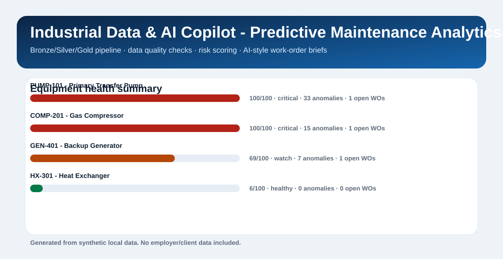

# Industrial Data & AI Copilot

Predictive maintenance portfolio case built to show how raw operational data can be ingested, validated, modeled, and translated into maintenance decisions that non-technical teams can actually use.

## Overview

This project simulates an industrial analytics workflow where sensor readings, maintenance orders, cost events, and work reports arrive as messy source files. The pipeline loads those inputs into a local warehouse, applies quality checks, builds Bronze, Silver, and Gold layers, and publishes business-facing outputs.

The point of the case is not only to move data. It is to show how data engineering, industrial context, and AI-style workflow support can come together in one practical delivery.

## Business Problem

Operations and maintenance teams usually do not struggle because data is completely absent. They struggle because the data is fragmented, inconsistent, and difficult to turn into action quickly.

This project is designed around a simple operational need:

- consolidate multiple operational sources
- catch bad records before they reach reporting
- score asset risk in a readable way
- generate short maintenance-oriented summaries for faster decision-making

## What This Project Demonstrates

- Bronze, Silver, and Gold pipeline design
- Python and SQL transformations on top of a local SQLite warehouse
- data quality checks for duplicates, missing values, invalid workflow states, and impossible readings
- industrial analytics across equipment, work orders, anomalies, and cost exposure
- AI-style maintenance briefs designed for stakeholder consumption
- recruiter-friendly outputs through a dashboard, case summary, and case study

## Architecture

```text
raw source files
  -> Bronze ingestion tables
  -> Silver validation and standardization
  -> Gold equipment health and work-order summaries
  -> dashboard.html + case_summary + case study
```

## Source Domains

The case uses four source domains:

- sensor readings
- maintenance orders
- cost events
- work reports

The inputs are synthetic and intentionally include dirty records so the quality layer has realistic issues to detect.

## Outputs

Running the pipeline generates:

- `data/raw/*.csv` - synthetic source files
- `data/warehouse/industrial_ops.db` - local warehouse
- `outputs/dashboard.html` - business-facing dashboard
- `outputs/case_summary.html` - short summary page
- `docs/case_study.html` - full case narrative

## Data Model

Bronze tables preserve ingested records:

- `bronze_sensor_readings`
- `bronze_maintenance_orders`
- `bronze_cost_events`
- `bronze_work_reports`

Silver tables standardize and validate records:

- `silver_sensor_readings`
- `silver_maintenance_orders`
- `silver_cost_events`
- `silver_work_reports`
- `data_quality_issues`

Gold tables support analytics consumption:

- `gold_equipment_health_summary`
- `gold_work_order_copilot_briefs`

## Repository Structure

```text
industrial-data-ai-copilot/
  data/
    raw/
    warehouse/
  docs/
    case_study.html
    case_study.md
  outputs/
    dashboard.html
    dashboard_preview.svg
    case_summary.html
    case_summary.md
  scripts/
    run_pipeline.py
  src/
    industrial_copilot/
      config.py
      generate_data.py
      pipeline.py
  tests/
    test_pipeline.py
```

## Quick Start

From this folder:

```powershell
python .\scripts\run_pipeline.py
python -m unittest discover -s .\tests
```

## Example Output



The dashboard highlights:

- highest-risk equipment
- anomaly counts
- open work orders
- cost exposure
- quality issues caught before downstream use
- AI-style work-order briefs

## Why This Case Matters

This project is a strong fit for Data Engineering, Analytics Engineering, and AI Automation conversations because it combines:

- ingestion and modeling discipline
- quality control
- business-facing metrics
- domain-aware framing
- automation that helps teams act faster

It also reflects the positioning behind the portfolio overall: operational data, practical analytics, and workflow acceleration rather than generic demo work.

